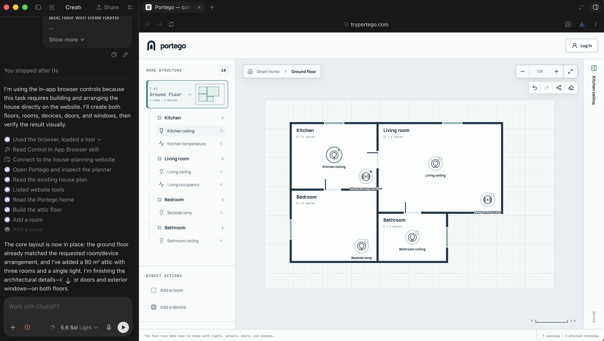
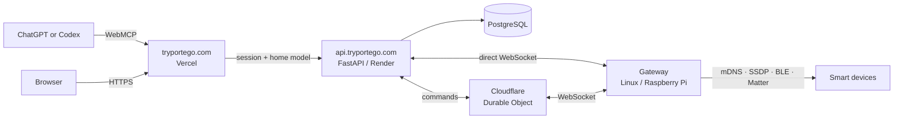
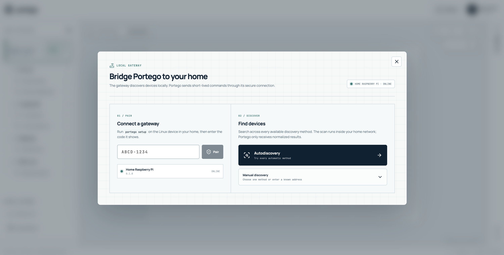

<p align="center">
  
</p>

<h1 align="center">Portego</h1>

<p align="center">
  <a href="LICENSE"></a>
  <a href="https://tryportego.com"></a>
  <a href="https://x.com/itsperini"></a>
</p>

Portego is a conversational digital twin for the smart home. Describe rooms and
devices to an assistant, see them on a shared canvas, and later bind that
design to real hardware through a local Linux gateway.



## Build your home

Open [tryportego.com](https://tryportego.com) in ChatGPT, Codex, or another
WebMCP-capable client and ask:

> Go to https://tryportego.com. Create a one-floor house with four rooms: an
> entrance that opens into a living room, a kitchen to its right, and a bedroom
> and bathroom along the back. Connect the rooms with doors, add a dimmable
> ceiling light in each room, and put a switch beside each door.

The assistant edits a validated home model through WebMCP. The same floor plan
appears in the browser, with undo and direct controls if you want to correct
it.

> [!NOTE]
> Already designed a home and want to bind real devices to it? Request
> private-beta login credentials from [@itsperini](https://x.com/itsperini) on X.

## How it works

- The **web canvas** is the shared spatial model: floors, rooms, devices,
  doors, and windows.
- A **Linux gateway** on the home network discovers devices and keeps
  credentials local. It opens an outbound connection only; no port forwarding.
- The **cloud API** stores the signed-in home, claims the gateway, and relays
  short-lived commands.
- **Adapters** (Shelly today, Matter discovery next) normalize hardware into
  bindable endpoints. Designed devices stay stable when hardware is replaced.



Vercel hosts the web app at tryportego.com. Render hosts FastAPI at
api.tryportego.com. The gateway connects with a direct WebSocket to the API,
or through a Cloudflare Durable Object. Details:
[`infrastructure/README.md`](infrastructure/README.md).

## Run locally

Requires Docker Desktop.

```sh
git clone git@github.com:itsperini/portego.git
cd portego
pnpm dev
```

- App: <http://localhost:3100>
- API: <http://localhost:4000/healthz>

Create a local user (password is prompted, not stored in shell history):

```sh
docker compose exec api uv run portego-user create --email you@example.com
```

`pnpm check` runs lint, types, tests, and production builds.

## Connect a gateway



On the always-on machine in the home, from this repository:

```sh
pnpm portego -- setup \
  --api https://api.tryportego.com \
  --name "Home Raspberry Pi"

pnpm dev:gateway
```

Open the printed URL, sign in, and approve the code. Then start the agent.
For a local API, pass `--api http://localhost:4000` instead.

Full CLI, discovery, and Cloudflare transport:
[`gateway/README.md`](gateway/README.md).

## Repository

| Path | Purpose |
| --- | --- |
| [`apps/web`](apps/web/README.md) | Next.js canvas and WebMCP tools |
| [`apps/api`](apps/api/README.md) | Auth, homes, gateway claim, and command relay |
| [`gateway`](gateway/README.md) | Linux agent, CLI, and discovery |
| [`adapters`](adapters/README.md) | Protocol drivers |
| [`packages`](packages/README.md) | Shared home model and gateway contracts |
| [`docs/architecture`](docs/architecture) | Architecture decisions |

Private beta includes canvas editing, persisted homes, gateway claiming, Shelly
control, and Matter discovery (commissioning not enabled yet). Public signup,
remote MCP OAuth, and a packaged Pi service are still planned.

## Get involved

Portego is still in beta. The canvas is open to try; accounts and live hardware
are invite-only. Contributions of all kinds are welcome: adapters, docs, bugs,
and ideas.

> [!TIP]
> Try the canvas at [tryportego.com](https://tryportego.com), open an issue or
> pull request on this repo, and reach [@itsperini](https://x.com/itsperini) on X.

## License

Apache License 2.0. See [`LICENSE`](LICENSE).
