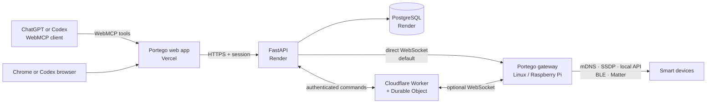

# Portego

Portego lets you design and control a smart home through a conversation. An AI
assistant edits the same spatial home model as the browser UI, while a local
Linux gateway discovers and controls devices without exposing the home network.


## Run locally

You need Docker Desktop with Docker Compose.

```sh
git clone git@github.com:itsperini/portego.git
cd portego
pnpm dev
```

Open:

- App: <http://localhost:3100>
- API health: <http://localhost:4000/healthz>
- API docs: <http://localhost:4000/docs>

Create a private-beta account. The command asks for the password securely:

```sh
docker compose exec api uv run portego-user create --email you@example.com
```

## Connect a gateway

Pair the computer that will stay on the home network:

```sh
pnpm portego -- setup --api http://localhost:4000 --name "Home gateway"
```

Open the URL printed by the command, log in, and approve the code. Then start
the gateway:

```sh
pnpm dev:gateway
```

The Gateway panel in the app will show it as online and can run discovery on
the gateway's local network. Raspberry Pi service installation and complete
gateway commands are documented in [`gateway/README.md`](gateway/README.md).

## Talk to the canvas

Open Portego in a WebMCP-capable browser or client and ask something like:

> Add a kitchen beside the living room, connect them with a door, and place a
> dimmable ceiling light in each room.

Portego exposes structured WebMCP tools for homes, floors, rooms, devices,
bindings, doors, windows, undo, and redo. The assistant changes the validated
home model instead of clicking arbitrary coordinates.

## How it works



- **Vercel** serves the Next.js canvas and its WebMCP tools.
- **Render** runs the FastAPI API and PostgreSQL database.
- **Cloudflare** optionally provides an edge relay with one hibernatable
  Durable Object connection per gateway.
- **The gateway** runs inside the home and only makes outbound connections.
- **Adapters** translate Matter, Shelly, and future protocols into one Portego
  device model.

The Cloudflare path is optional; direct gateway-to-Render WebSocket remains the
default. See [`infrastructure/cloudflare-relay/README.md`](infrastructure/cloudflare-relay/README.md).

## Repository map

| Path | Purpose |
| --- | --- |
| [`apps/web`](apps/web/README.md) | Next.js, Konva canvas, and WebMCP tools |
| [`apps/api`](apps/api/README.md) | FastAPI authentication, homes, and gateway relay |
| [`gateway`](gateway/README.md) | Gateway CLI, agent, discovery, and runtime |
| [`adapters`](adapters/README.md) | Device and protocol integrations |
| [`packages`](packages/README.md) | Shared models, messages, and gateway contracts |
| [`infrastructure`](infrastructure/README.md) | Render and optional Cloudflare deployment |
| [`docs/architecture`](docs/architecture) | Architecture decision records |

## Verify the repository

```sh
pnpm check
```

This runs formatting and lint checks, TypeScript and Python type checks, tests,
and production builds across the monorepo.

## Current scope

Implemented: private-beta login, persistent homes, a Konva floor-plan editor,
WebMCP editing, gateway claiming, local discovery, Shelly support, Matter
discovery boundaries, direct WebSocket transport, and the optional Cloudflare
relay.

Still planned: public signup and recovery, multiple homes, production MCP OAuth,
full Matter commissioning, and an installable Raspberry Pi system service.

## License

Apache License 2.0. See [`LICENSE`](LICENSE).
